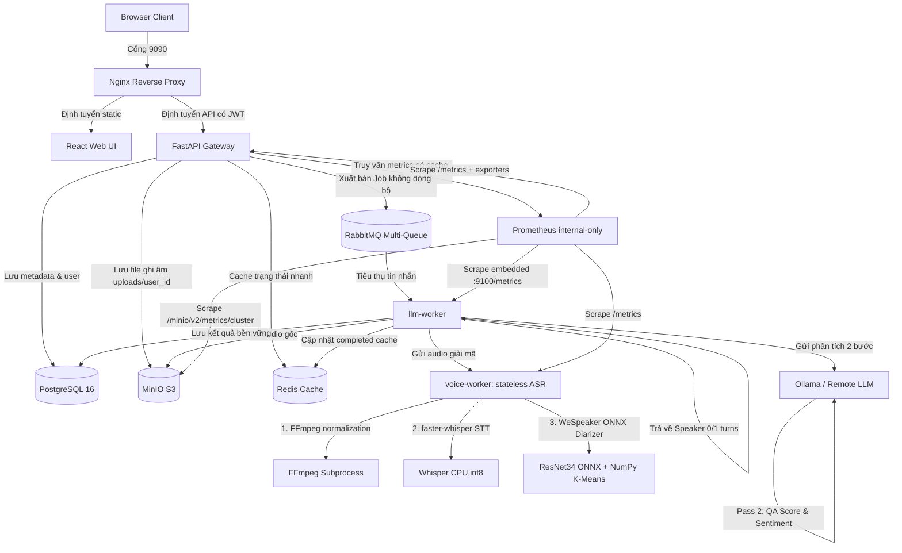

<div align="center">

# Voice Sentiment

**AI-powered customer service call analysis, speaker diarization, and performance evaluation platform.**


[Overview](#overview) · [System Flow](#system-flow) · [Quick Start](#quick-start) · [Pipelines](#application-pipelines) · [Repository Map](#repository-map) · [Docs](#docs-index)

</div>

---

## Overview

Voice Sentiment is a production-ready call center analytics and quality assurance system. It processes phone recordings or text dialogs, applies deep-learning speaker diarization (ONNX) to split speakers, transcribes the voice using local Whisper ASR, maps roles semantically, and utilizes a remote or local self-hosted LLM (such as Ollama) to analyze conversation sentiment and score customer service agent performance.

| Component | Tech Stack | Current State |
|---|---|---|
| **Backend API** | FastAPI + SQLAlchemy + Alembic | Implemented: JWT Auth, RBAC roles, tenant data isolation, DB migrations, RabbitMQ job publisher |
| **Frontend UI** | React + Vite + TypeScript + CSS | Implemented: feature-based `auth`/`analysis`/`admin` modules, login/register, personal dashboard, admin overview panel, admin metrics dashboard with 9 target health cards and 10 aggregated metrics, SVG donut & weekly charts |
| **Voice Worker** | faster-whisper + WeSpeaker ONNX | Implemented: stateless ASR, FFmpeg PCM 16kHz resampling, ResNet34 ONNX diarizer + NumPy K-Means clustering |
| **LLM Worker** | RabbitMQ + LLM client | Implemented: asynchronous job orchestration, tenant prefix caching, Two-Pass LLM (remote or local self-hosted Ollama) role mapping and QA score evaluation |
| **Infrastructure** | Postgres, Redis, RabbitMQ, MinIO, Nginx, Prometheus, Ollama | Implemented: local-first Docker bridge network, master `.env` at root, hidden container port security, host port hardening (localhost only), Prometheus internal-only observability with backend metrics proxy (9 targets including MinIO), Redis 10s cache |

---

## System Flow



---

## Quick Start

All commands must be executed from the repository root.

### 1. Centralized Environment Configuration

Configure all environment variables dynamically from the centralized master `.env` file at the root.

To start, make a copy of the root `.env` from a copy (if not already existing):
```bash
cp .env.example .env
```

### 2. Startup Infrastructure and Services

Start all services (Databases, Queues, ASR Worker, LLM Worker, Backend Gateway, and Frontend React App) in detached mode:

```bash
# Rebuild and start all containers in internal network
docker compose up -d --build
```

### 3. Verify Container Status

Ensure all containers are running and healthy:

```bash
docker compose ps
```

### 4. Verify Prometheus Observability

Prometheus UI is exposed locally on `http://localhost:9095`. For security and administrative control, the backend also exposes a proxy metrics endpoint (requires admin authorization):

```bash
# Query the system metrics endpoint on the backend (requires an admin session JWT)
curl "http://localhost:9090/api/admin/metrics"
```

Expected: Returns aggregated metrics JSON including `serviceHealth` for 9 targets (backend, frontend via nginx, voice-worker, llm-worker, postgres, redis, rabbitmq, nginx, minio) and a single `cards` array with 10 metrics in order: Targets online, Voice jobs, LLM jobs, Request rate, 5xx rate, API P95, MinIO storage used, Postgres size, Redis memory, RabbitMQ messages.

### 5. Running Tests in Containers

Execute unit tests within the core worker containers to verify health:

```bash
# Test voice-worker ASR and Diarization
docker exec voice-sentiment-voice-worker-1 pytest

# Test llm-worker RabbitMQ and LLM orchestration
docker exec voice-sentiment-llm-worker-1 pytest
```

---

## Manual Start (Local Development)

Use this when running services directly on your host machine instead of Docker containers.

### 1. Start Infrastructure Stack

```bash
# Starts Postgres, Redis, RabbitMQ, MinIO, Adminer and RedisInsight
docker compose up -d postgres redis rabbitmq minio adminer redisinsight
```

### 2. Start Backend API Gateway

Copy root `.env.example` to `.env` and ensure host environment variables are set, then:

```bash
cd backend
python -m venv venv
# Windows
.\venv\Scripts\activate
# Linux
source venv/bin/activate

pip install -r requirements.txt
python -m app.main
```
* API Docs Swagger: `http://localhost:8000/docs`

### 3. Start Frontend Dashboard

```bash
cd frontend
npm install
npm run dev
```
* Development URL: `http://localhost:5173`

### 4. Start Voice Worker STT

```bash
cd voice-worker
python -m venv venv
# Windows
.\venv\Scripts\activate
# Linux
source venv/bin/activate

pip install -r requirements.txt
python -m app.main
```
* Stateless ASR docs: `http://localhost:8000/docs`

### 5. Start LLM Analysis Worker

```bash
cd llm-worker
python -m venv venv
# Windows
.\venv\Scripts\activate
# Linux
source venv/bin/activate

pip install -r requirements.txt
python -m app.main
```

---

## Application Pipelines

### Asynchronous Analysis Pipeline

| Step | Component | Action |
|---:|---|---|
| 1 | Browser UI | User uploads audio recording or text to Gateway |
| 2 | Backend API | Saves file to MinIO (`uploads/{owner_id}/{filename}`) and registers `pending` Postgres job |
| 3 | RabbitMQ | Publishes job ID and metadata into `analysis.jobs` queue |
| 4 | `llm-worker` | Consumes job, downloads audio from MinIO S3 |
| 5 | `voice-worker` | normalizes audio (FFmpeg Mono 16kHz PCM), runs Whisper STT and ResNet34 ONNX Diarizer |
| 6 | `llm-worker` | Semantic role maps turns, calls Remote LLM for sentiment/QA evaluation, saves results to Postgres and Redis cache |
| 7 | Browser UI | Polling client fetches completed results from Redis cache under 1ms |

### Authentication & Tenant Isolation Pipeline

| Step | Component | Action |
|---:|---|---|
| 1 | `AuthContext` | Handles user registration (`POST /api/auth/register`) and login jwt generation |
| 2 | Backend Gateway | Decrypts JWT and injects `current_user` info |
| 3 | Repositories | Filters all requests (`GET /api/analysis`, `stats`) strictly by `owner_id = current_user.id` |
| 4 | Object Storage | Partitions audio file prefixes by `uploads/{owner_id}/*` |
| 5 | Redis Cache | Keyspaces state records by `cache:user:{owner_id}:analysis:{job_id}` |

---

## Deployment Profiles

| Profile | Cwd / Entry point | Description | Ports (Host) |
|---|---|---|---|
| **Nginx Proxy** | `docker-compose.yml` | Nginx reverse proxy routing web requests | `0.0.0.0:9090` (LAN) |
| **Backend Gateway** | `backend/` | FastAPI gateway handling Auth, CRUD, DB, and Storage | Internal `8000` |
| **Frontend UI** | `frontend/` | React dashboard panel organized by feature modules | Internal `5173` |
| **Voice Worker** | `voice-worker/` | Stateless ASR, VAD & speaker segment diarizer | Internal `8000` |
| **LLM Worker** | `llm-worker/` | Asynchronous RabbitMQ consumer and LLM client | Internal |
| **Ollama (Optional)** | `docker-compose.yml` | Local LLM server running qwen2.5:1.5b | Internal `11434` |
| **Adminer** | `docker-compose.yml` | PostgreSQL DB client UI | `127.0.0.1:9091` |
| **MinIO Console** | `docker-compose.yml` | Object storage browser interface | Console `127.0.0.1:9092` (S3 API Internal `9000`) |
| **RedisInsight** | `docker-compose.yml` | Redis key monitor console | `127.0.0.1:9093` |
| **RabbitMQ Admin** | `docker-compose.yml` | Message broker management dashboard | `127.0.0.1:9094` |
| **Prometheus UI** | `docker-compose.yml` | Metrics query and visualization dashboard | `127.0.0.1:9095` |

---

## Repository Map

```text
.
├── backend/                         FastAPI Gateway Server
│   ├── alembic/                     Database schema version controller
│   ├── app/
│   │   ├── configs/                 Settings, DB session, cache, queue and storage configs
│   │   ├── controllers/             Auth, Analysis, Files, Admin and Health API controllers
│   │   ├── dtos/                    Pydantic request/response contracts
│   │   ├── services/                Auth, analysis, file and admin business workflows
│   │   ├── repositories/            SQLAlchemy data access
│   │   └── models/                  SQLAlchemy ORM models
│   └── requirements.txt
│
├── frontend/                        React Dashboard Client Panel
│   ├── src/
│   │   ├── app/                     App shell router
│   │   ├── features/
│   │   │   ├── auth/                Login/register API, DTOs, state, screens, components
│   │   │   ├── analysis/            Analysis API, DTOs, state helpers, dashboard screen, UI components
│   │   │   └── admin/               Admin API, DTOs, state, metrics screen and components
│   │   └── styles/                  Main CSS design system variables
│   └── package.json
│
├── voice-worker/                    Stateless ASR & ONNX Speaker Diarization Service
│   ├── app/
│   │   ├── controllers/             Transcription HTTP controller
│   │   ├── configs/                 Model/settings config
│   │   ├── services/                Transcription orchestration service
│   │   └── ai/                      faster-whisper STT client & WeSpeaker ONNX Diarizer
│   └── Dockerfile
│
├── llm-worker/                      Asynchronous Orchestrator & Two-Pass LLM Analyst
│   ├── app/
│   │   ├── configs/                 Settings, DB session, S3 MinIO, Redis cache, RabbitMQ consumer and metrics server
│   │   ├── services/                AnalyzeJob orchestration service
│   │   ├── repositories/            Postgres job/result persistence
│   │   ├── models/                  SQLAlchemy ORM models
│   │   └── ai/                      Two-Pass LLM client
│   └── Dockerfile
│
├── docs/                            Architecture explanations only
│   └── explanations/                Backend, frontend, worker and infrastructure explanations
├── infras/                          Runtime infra configs for Nginx and Prometheus
│   ├── nginx.conf                   Local Reverse Proxy Gateway config
│   └── prometheus.yml               Prometheus scrape config for app and infra metrics
├── docker-compose.yml               Production-grade microservices coordinator
└── .env                             Master centralized environment configuration
```

---

## Docs Index

Detailed design documents are maintained under `docs/`:

| Document | Purpose |
|---|---|
| [**`backend-explanation.md`**](file:///d:/voice-sentiment/docs/explanations/backend-explanation.md) | FastAPI Gateway controllers, JWT security, and Alembic DB schema |
| [**`frontend-explanation.md`**](file:///d:/voice-sentiment/docs/explanations/frontend-explanation.md) | React UI, feature-based frontend modules, DTO/state layers, CSS variables, and dynamic chart styling |
| [**`worker-explanation.md`**](file:///d:/voice-sentiment/docs/explanations/worker-explanation.md) | Whisper ASR, Silero VAD, WeSpeaker ONNX Diarization & Two-Pass LLM workflows |
| [**`infrastructure-explanation.md`**](file:///d:/voice-sentiment/docs/explanations/infrastructure-explanation.md) | Centralized Master `.env`, Nginx/Prometheus observability, multi-queueing and hidden container firewalls |

---

## Service Credentials Reference

Read all values dynamically from the root `.env` file when deploying to Production.

| Service | Host Port | Username | Password |
|---|---|---|---|
| **Nginx (App Gateway)** | `0.0.0.0:9090` (LAN) | — | Create/Register in Web UI |
| **Adminer** | `127.0.0.1:9091` | `voice` | `voice` (Server: `postgres`) |
| **MinIO Console** | `127.0.0.1:9092` | `minioadmin` | `minioadmin` |
| **RedisInsight** | `127.0.0.1:9093` | — | — (connect to `redis`) |
| **RabbitMQ Management** | `127.0.0.1:9094` | `guest` | `guest` |
| **PostgreSQL DB** | `127.0.0.1:5432` | `voice` | `voice` (DB: `voice_sentiment`) |
| **Ollama (Optional)** | `127.0.0.1:11434` | — | — |

---

## Architecture Accuracy Notes

- **Production-ready Port Firewalls**: Containers for `backend` and `frontend` have no exposed ports on the host. Every web package must route through Nginx proxy (`9090`) to access app assets, preventing bypass attacks.
- **Prometheus Internal-Only**: Frontend admin metrics dashboard calls `GET /api/admin/metrics` on the backend with admin authorization. The backend proxies Prometheus internally (Docker network) and caches the aggregated metrics on Redis for 10 seconds (`admin:metrics:snapshot`). Prometheus API is never exposed through Nginx or to the public network.
- **Stateless/Stateful Segregation**: `voice-worker` holds zero database connections or state adapters, caching Whisper ASR and WeSpeaker ONNX models completely in-memory to scale rapidly.
- **Tenant Isolation**: Data boundaries (S3 files, Redis caches, Postgres tables) are strictly separated by the UUID `owner_id` context.
- **Centralized Master `.env`**: Build artifacts are stateless and decoupled from environment configs. Keep only root `.env` and `.env.example`; service-level `.env*` files are intentionally not used.
- **Host Port Hardening**: All internal databases, caches, queues, and helper services are bound strictly to `127.0.0.1` (localhost) on the host machine for production-grade security. Only the Nginx Gateway (`9090`) is exposed to `0.0.0.0` to safely allow LAN clients to access the web platform.
